<div align="center">

<!-- Animated Header -->


<!-- Animated Subtitle -->


<!-- Social Badges with Hover Effect -->
<p align="center">
  <a href="https://28naresh.netlify.app/">
    
  </a>
  <a href="https://linkedin.com/in/@28naresh">
    
  </a>
  <a href="https://instagram.com/@itts_naresh_">
    
  </a>
  <a href="mailto:naresh282004@gmail.com">
    
  </a>
</p>

<!-- Profile Views Counter with Animation -->


</div>

<br/>

<!-- Animated Divider -->


<br/>

##  About Me

```typescript
class FullStackDeveloper {
  constructor() {
    this.name = "Naresh ";
    this.location = "Bareilly, Uttar Pradesh, India 🇮🇳";
    this.education = {
      current: "MCA Student",
      completed: "BCA Graduate"
    };
    this.title = "Full Stack Developer";
  }

  getCurrentWork(): string[] {
    return [
      "🔭 Building scalable web applications",
      "🌱 Learning advanced system design & cloud architecture",
      "👯 Looking to collaborate on open-source projects",
      "💬 Ask me about web development, DSA, or photography 📸",
      "⚡ Fun fact: I debug with coffee and capture life with a camera!"
    ];
  }

  getDailyRoutine(): object {
    return {
      morning: "☕ Coffee + Code",
      afternoon: "💻 Development + Learning",
      evening: "📚 Problem Solving + DSA",
      night: "🌙 Side Projects + Photography"
    };
  }
}

const naresh = new FullStackDeveloper();
console.log(naresh.getCurrentWork());
```

<br/>

<!-- Animated Divider -->


<br/>

##  Tech Stack & Skills

<div align="center">

### 🎨 Frontend Development
<table>
  <tr>
    <td align="center" width="96">
      
      <br>HTML5
    </td>
    <td align="center" width="96">
      
      <br>CSS3
    </td>
    <td align="center" width="96">
      
      <br>JavaScript
    </td>
    <td align="center" width="96">
      
      <br>React
    </td>
    <td align="center" width="96">
      
      <br>Redux
    </td>
    <td align="center" width="96">
      
      <br>Tailwind
    </td>
    <td align="center" width="96">
      
      <br>Bootstrap
    </td>
  </tr>
</table>

### ⚙️ Backend Development
<table>
  <tr>
    <td align="center" width="96">
      
      <br>Node.js
    </td>
    <td align="center" width="96">
      
      <br>Express
    </td>
    <td align="center" width="96">
      
      <br>Python
    </td>
    <td align="center" width="96">
      
      <br>Java
    </td>
    <td align="center" width="96">
      
      <br>PHP
    </td>
    <td align="center" width="96">
      
      <br>C++
    </td>
    <td align="center" width="96">
      
      <br>C
    </td>
  </tr>
</table>

### 💾 Database & Cloud
<table>
  <tr>
    <td align="center" width="96">
      
      <br>MongoDB
    </td>
    <td align="center" width="96">
      
      <br>MySQL
    </td>
    <td align="center" width="96">
      
      <br>PostgreSQL
    </td>
    <td align="center" width="96">
      
      <br>Firebase
    </td>
    <td align="center" width="96">
      
      <br>AWS
    </td>
    <td align="center" width="96">
      
      <br>Netlify
    </td>
    <td align="center" width="96">
      
      <br>Vercel
    </td>
  </tr>
</table>

### 🛠️ Tools & Technologies
<table>
  <tr>
    <td align="center" width="96">
      
      <br>Git
    </td>
    <td align="center" width="96">
      
      <br>GitHub
    </td>
    <td align="center" width="96">
      
      <br>VS Code
    </td>
    <td align="center" width="96">
      
      <br>Postman
    </td>
    <td align="center" width="96">
      
      <br>Docker
    </td>
    <td align="center" width="96">
      
      <br>NPM
    </td>
    <td align="center" width="96">
      
      <br>Linux
    </td>
  </tr>
</table>

### 🎨 Design & Creative
<table>
  <tr>
    <td align="center" width="96">
      
      <br>Photoshop
    </td>
    <td align="center" width="96">
      
      <br>Figma
    </td>
    <td align="center" width="96">
      
      <br>Adobe XD
    </td>
    <td align="center" width="96">
      
      <br>Adobe Suite
    </td>
    <td align="center" width="96">
      
      <br>Canva
    </td>
  </tr>
</table>

</div>

<br/>

<!-- Animated Divider -->


<br/>

## 📊 GitHub Analytics

<div align="center">
   
  
  
</div>

<div align="center">
  
  
  
</div>

<!-- Activity Graph -->


<br/>

<!-- Animated Divider -->


<br/>

## 🏆 GitHub Trophies

<div align="center">
  
</div>

<br/>

<!-- Animated Divider -->


<br/>

## 🎯 2026 Goals & Roadmap

```mermaid
graph LR
    A[🎯 2026 Goals] --> B[Master System Design]
    A --> C[AWS Certification]
    A --> D[10+ Open Source]
    A --> E[5 Full Stack Apps]
    A --> F[Mentor Developers]
    
    B --> G[✨ Advanced Patterns]
    C --> H[☁️ Cloud Expert]
    D --> I[🤝 Community]
    E --> J[🚀 Production Ready]
    F --> K[📚 Share Knowledge]
    
    style A fill:#FF6C37,stroke:#fff,stroke-width:2px,color:#fff
    style B fill:#6C63FF,stroke:#fff,stroke-width:2px,color:#fff
    style C fill:#6C63FF,stroke:#fff,stroke-width:2px,color:#fff
    style D fill:#6C63FF,stroke:#fff,stroke-width:2px,color:#fff
    style E fill:#6C63FF,stroke:#fff,stroke-width:2px,color:#fff
    style F fill:#6C63FF,stroke:#fff,stroke-width:2px,color:#fff
```

<div align="center">



</div>

<br/>

<!-- Animated Divider -->


<br/>

## 🐍 Contribution Snake

<picture>
  <source media="(prefers-color-scheme: dark)" srcset="https://raw.githubusercontent.com/Naresh-28/Naresh-28/output/github-contribution-grid-snake-dark.svg">
  <source media="(prefers-color-scheme: light)" srcset="https://raw.githubusercontent.com/Naresh-28/Naresh-28/output/github-contribution-grid-snake.svg">
  
</picture>

<br/>

<!-- Animated Divider -->


<br/>

## 💡 Random Dev Quote

<div align="center">
  
</div>

<br/>

<!-- Animated Divider -->


<br/>

## 🤝 Let's Connect & Collaborate!

<div align="center">

### 💬 I'm always excited to connect with fellow developers and tech enthusiasts!

<table>
  <tr>
    <td align="center" width="200">
      
      <br><b>Open for</b>
      <br>Discussions
    </td>
    <td align="center" width="200">
      
      <br><b>Freelance</b>
      <br>Projects
    </td>
    <td align="center" width="200">
      
      <br><b>Full-time</b>
      <br>Opportunities
    </td>
    <td align="center" width="200">
      
      <br><b>Innovative</b>
      <br>Collaborations
    </td>
  </tr>
</table>

### 📬 Reach Out to Me

[](https://28naresh.netlify.app/)
[](mailto:naresh282004@gmail.com)

<br/>

### 🌟 If you find my work interesting, consider giving it a ⭐!

</div>

<br/>

<!-- Animated Footer -->


<div align="center">
  
  <!-- Footer Text -->
  
  
  <br/><br/>
  
  **⭐ From [Naresh](https://github.com/Naresh-28) | Built with 💜 and ☕ | Last Updated: 2026**
  
</div>
